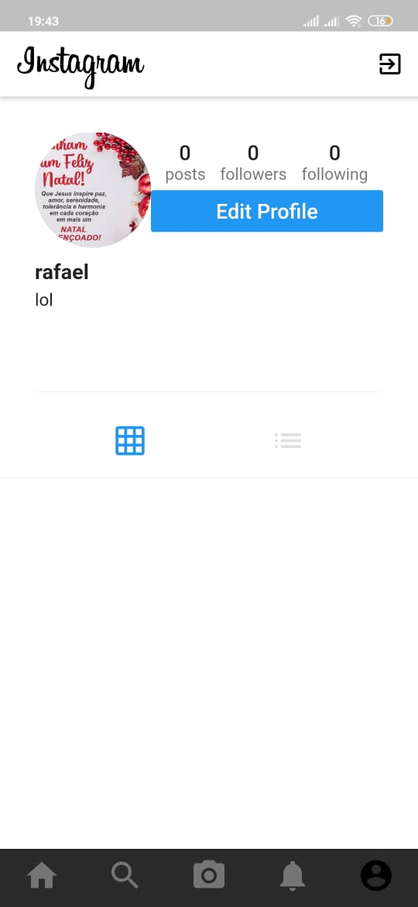

# Instagram Clone

App Instagram Clone o app foi elaborado apenas para estudo onde foi clonado o app do Instagram e finalizado usando as tecnologia flutter foi finalizado tanto para IOS quanto para ANDROID e no back end foi usado Firebase para upload das imagens e profile.
Foi desenvolvido no Android studio

TECNOLOGIAS USADAS:

 *FLutter
 *Dart
 *Firebase
 

 

## Getting Started

This project is a starting point for a Flutter application.

A few resources to get you started if this is your first Flutter project:

- [Lab: Write your first Flutter app](https://flutter.dev/docs/get-started/codelab)
- [Cookbook: Useful Flutter samples](https://flutter.dev/docs/cookbook)

For help getting started with Flutter, view our
[online documentation](https://flutter.dev/docs), which offers tutorials,
samples, guidance on mobile development, and a full API reference.
